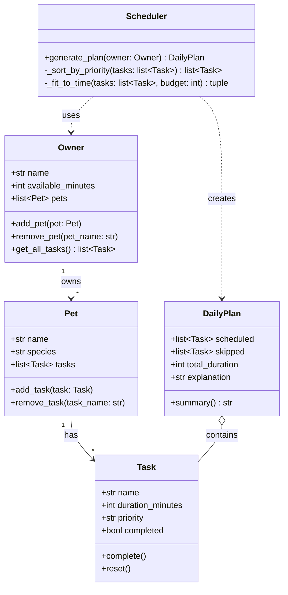

# PawPal+ Project Reflection

## 1. System Design

**a. Initial design**

**Three core user actions:**

1. **Enter owner and pet information** — The user provides basic context: their name, the pet's name and type, and how much time they have available each day. This data drives the scheduler's constraints and personalizes the care plan.

2. **Add and manage care tasks** — The user can create, edit, and remove individual pet care tasks (such as a morning walk, feeding, medication, or grooming). Each task has at minimum a name, estimated duration, and priority level so the scheduler knows what must be done versus what is optional.

3. **Generate and review the daily schedule** — The user triggers the scheduler to produce a concrete daily plan fitted to their available time and task priorities. The app displays the ordered list of tasks and explains why that particular plan was chosen (e.g., high-priority tasks scheduled first, tasks dropped due to time constraints).

**Class diagram (Mermaid):**

**Design notes:**
- `Owner` is the root object — it holds the time budget and aggregates all pets (and transitively all tasks) via `get_all_tasks()`.
- `Task` is intentionally simple: name, duration, priority, and completion flag cover the scheduling requirements without over-engineering.
- `Scheduler` is stateless (no stored data) — it takes an `Owner` and returns a `DailyPlan`, making it easy to test in isolation.
- `DailyPlan` separates scheduled from skipped tasks so the UI can show both the plan and what was dropped (with `explanation` providing the reasoning).

**Classes and their responsibilities (as implemented in `pawpal_system.py`):**

| Class | Type | Responsibility |
|---|---|---|
| `Priority` | Enum | Defines the three valid priority levels (LOW, MEDIUM, HIGH) with explicit ordering |
| `Task` | Dataclass | Stores a single care activity: name, duration, priority, pet name, and completion state |
| `Pet` | Dataclass | Groups tasks under a named animal; stamps each added task with the pet's name |
| `Owner` | Class | Root object; holds the daily time budget and a list of pets; provides `get_all_tasks()` to flatten all tasks |
| `DailyPlan` | Dataclass | Holds the scheduler's output — scheduled tasks, skipped tasks, total duration, and a plain-text explanation |
| `Scheduler` | Class | Stateless engine; sorts tasks by priority, fits them greedily into the owner's time budget, and returns a `DailyPlan` |

**b. Design changes**

When I reviewed the skeleton (`pawpal_system.py`) against the original UML, I caught two problems and made two changes:

**Change 1: Replaced `str` priority with a `Priority` enum**

In the UML I wrote `priority: str` on `Task`. While reviewing the skeleton I realised that `_sort_by_priority` would need to compare those strings — and alphabetical order gives `"high" < "low" < "medium"`, which is completely wrong. I changed `priority` to a `Priority(str, Enum)` with members `LOW`, `MEDIUM`, `HIGH`. Because it inherits from `str`, it still serialises cleanly to `"low"` / `"medium"` / `"high"` for the UI and JSON, but now I can define an explicit sort order and the valid values are self-documenting. Raw strings for something the scheduler branches on would have been a silent bug waiting to happen.

**Change 2: Added `pet_name: str` to `Task`**

`Owner.get_all_tasks()` flattens all tasks from all pets into a single list. Once that happens, each `Task` loses the information about which pet it came from. When `DailyPlan` builds its `explanation` string it needs to say things like "Mochi: morning walk (20 min)" — but with the original UML it would only know the task name, not the animal. I added `pet_name: str = ""` to `Task` and made `Pet.add_task()` responsible for stamping that field when a task is attached. This keeps `Task` self-contained (no back-reference to a `Pet` object) while preserving the context the scheduler and UI need. The tradeoff is a mild redundancy — the pet name lives both on `Pet.name` and on each of its `Task.pet_name` fields — but that's a reasonable price for a flat, easy-to-iterate data structure.

---

## 2. Scheduling Logic and Tradeoffs

**a. Constraints and priorities**

- What constraints does your scheduler consider (for example: time, priority, preferences)?
- How did you decide which constraints mattered most?

**b. Tradeoffs**

- Describe one tradeoff your scheduler makes.
- Why is that tradeoff reasonable for this scenario?

---

## 3. AI Collaboration

**a. How you used AI**

- How did you use AI tools during this project (for example: design brainstorming, debugging, refactoring)?
- What kinds of prompts or questions were most helpful?

**b. Judgment and verification**

- Describe one moment where you did not accept an AI suggestion as-is.
- How did you evaluate or verify what the AI suggested?

---

## 4. Testing and Verification

**a. What you tested**

- What behaviors did you test?
- Why were these tests important?

**b. Confidence**

- How confident are you that your scheduler works correctly?
- What edge cases would you test next if you had more time?

---

## 5. Reflection

**a. What went well**

- What part of this project are you most satisfied with?

**b. What you would improve**

- If you had another iteration, what would you improve or redesign?

**c. Key takeaway**

- What is one important thing you learned about designing systems or working with AI on this project?
